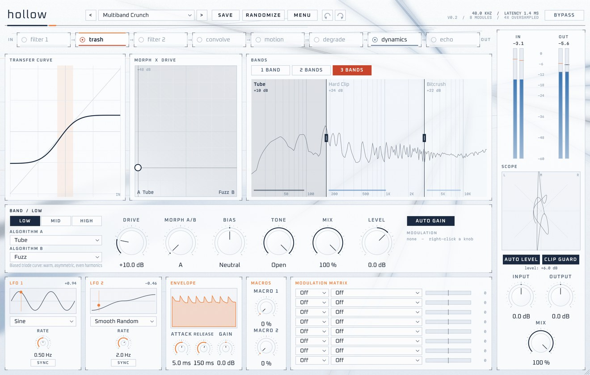
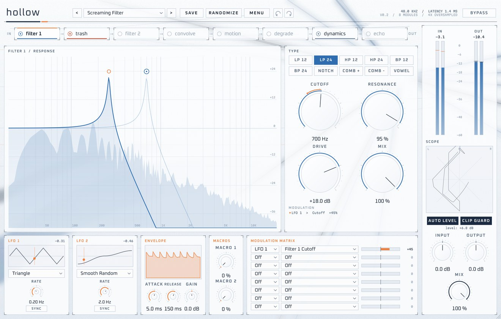
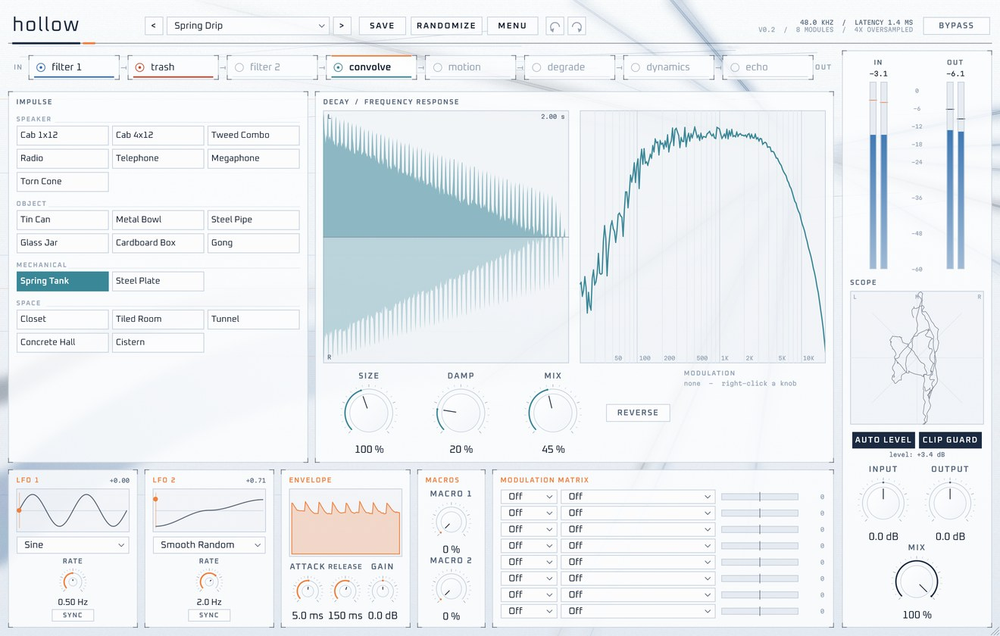
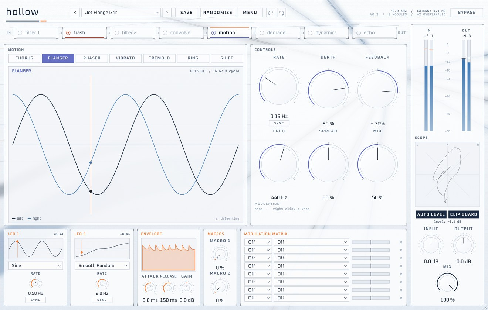
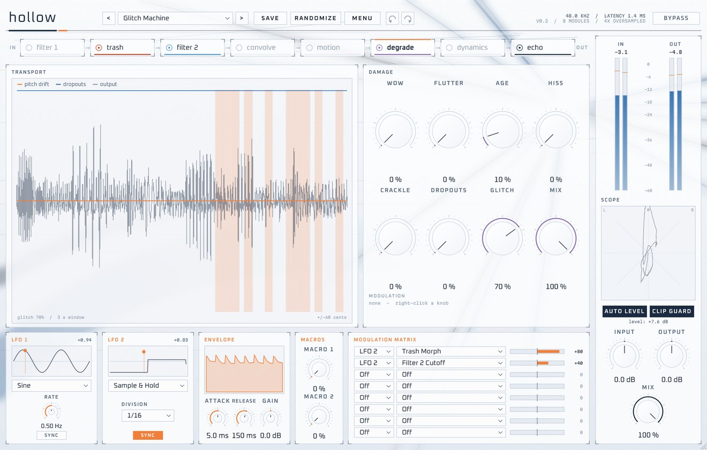
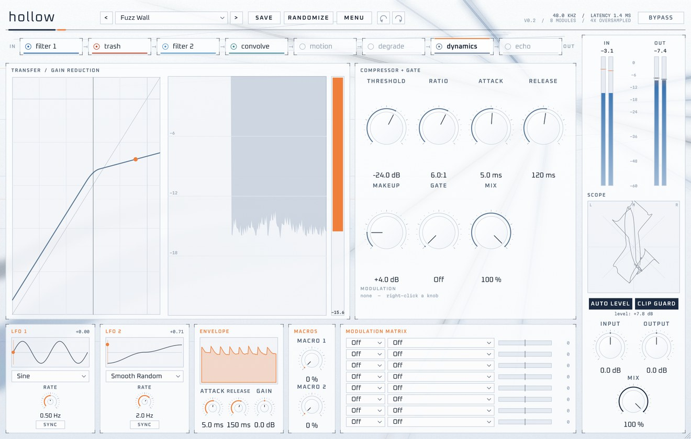
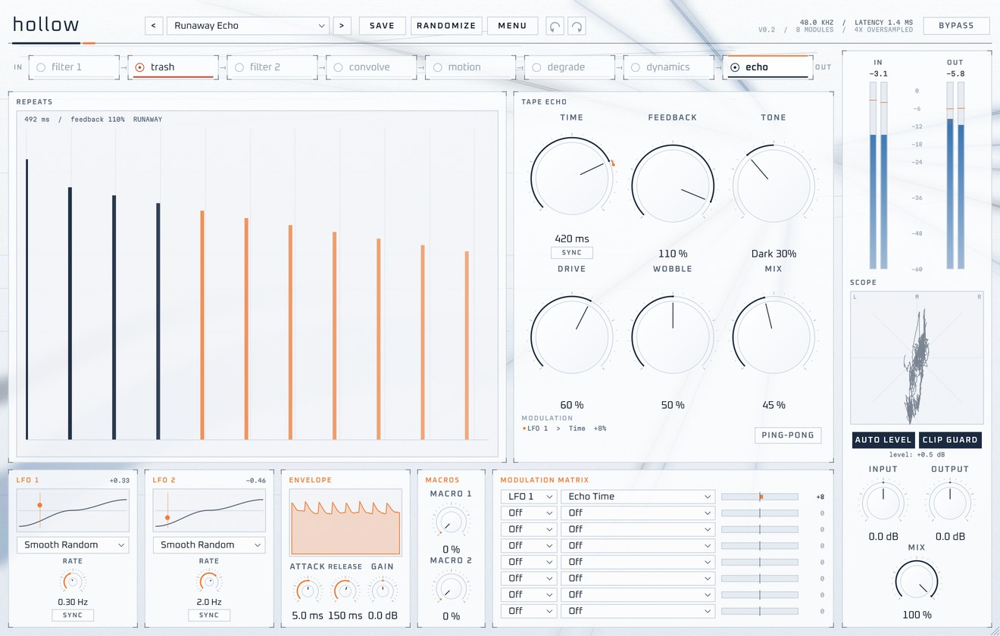
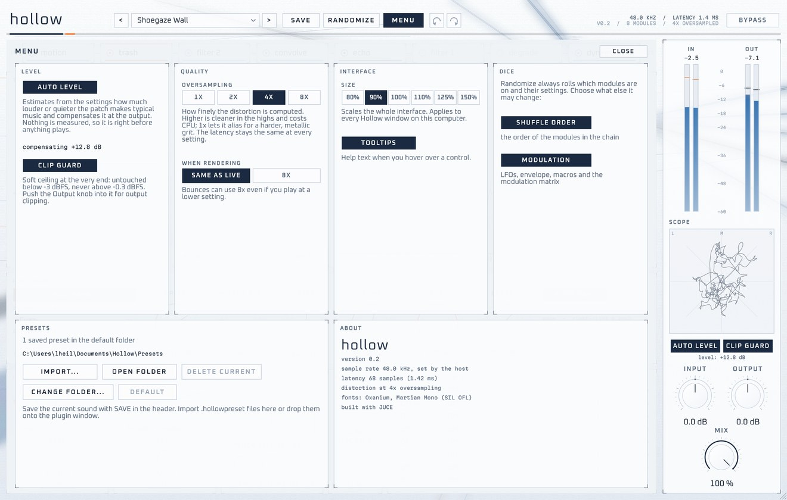
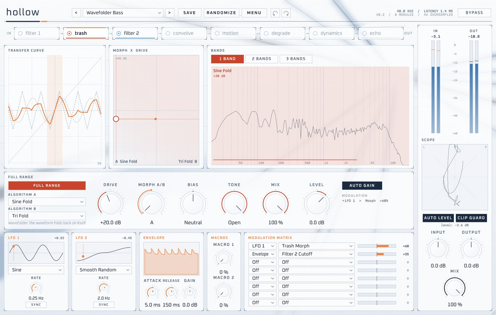

<h1 align="center">hollow</h1>

<p align="center">
  <b>A distortion and texture plugin.</b><br>
  Eight effects in any order, modulation everywhere, and a dice.
</p>

<p align="center">
  
  
  
  
</p>


Hollow runs your sound through eight effects: distortion, two filters, convolution, modulation effects, tape and vinyl
damage, dynamics and a tape echo. Drag them into any order (fuzz *after* a reverb, chorus *into* a wavefolder),
modulate almost anything, and let the dice come up with combinations you wouldn't have tried.

## Highlights

- **26 distortion algorithms** in seven families, up to three bands, each morphing between two algorithms
- **A chain you can reorder** by dragging: the same modules in a different order are a different instrument
- **Modulation everywhere**: two LFOs, an envelope follower and two macros through an 8-slot matrix; right-click
  any knob to modulate it, and every display moves with it
- **20 synthesised impulses**: speaker cabinets, telephone, tin can, gong, spring tank, cistern. Because they're
  modelled, *Size* really rescales the object
- **Tape and vinyl damage** with a glitch engine that stutters, reverses and half-speeds slices in time with your song
- **Presets and dice**: 27 factory presets, save and import your own, randomize with rules
- **Auto Level**: every patch comes out at the loudness of what goes in, worked out from the settings, so it's right
  before anything plays
- **Oversampling from 1x to 8x** at constant latency; render at 8x while playing at less
- **Undo and redo**, an interface that zooms from 80 to 150 %, and no surprises in level thanks to a soft clip guard

## The modules

<table>
<tr>
<td width="50%" valign="top">
<br>
<b>Trash</b>: saturate, clip, fuzz, fold, rectify, digital and harmonic algorithms. Up to three bands, each blending
two algorithms on a morph and drive pad, with bias, tone, mix and level. The transfer curve shows how hard each band
is being hit.
</td>
<td width="50%" valign="top">
<br>
<b>Filter 1 and 2</b>: low, high and band-pass (12 and 24 dB), notch, combs and vowel formants. The resonance screams
but stays bounded. Drag the node, or let an LFO do it: the curve follows live.
</td>
</tr>
<tr>
<td width="50%" valign="top">
<br>
<b>Convolve</b>: cabinets, radio, telephone, megaphone, found objects, spring and plate, rooms up to a cistern. Size,
damp and reverse, with zero added latency.
</td>
<td width="50%" valign="top">
<br>
<b>Motion</b>: chorus, flanger, phaser, vibrato, tremolo (chop and auto-pan), ring modulator and a frequency shifter
with barber-pole feedback. Free-running or locked to the host tempo.
</td>
</tr>
<tr>
<td width="50%" valign="top">
<br>
<b>Degrade</b>: wow, flutter, worn tape, hiss, vinyl crackle, dropouts, and glitch: random stutters, reverses and
half-speed repeats on a 16th-note grid.
</td>
<td width="50%" valign="top">
<br>
<b>Dynamics</b>: a gate into a soft-knee compressor with parallel mix. Pull a distortion's tail up into sustain or
chop it into gated textures.
</td>
</tr>
<tr>
<td width="50%" valign="top">
<br>
<b>Echo</b>: a tape echo whose repeats pass through drive and tone every time. Time changes glide into pitch bends,
and past 100 % feedback it runs away into a self-oscillating wall that still stays under control.
</td>
<td width="50%" valign="top">
<br>
<b>Menu</b>: Auto Level and clip guard, oversampling (playback and render), interface size, what the dice may
change, and your preset folder: import, open, change.
</td>
</tr>
</table>

## Modulation



LFO 1 and 2 (sine, triangle, ramps, square, sample and hold, smooth random; free or synced and phase-locked to the
song), an envelope follower and two macro knobs feed an 8-slot matrix with about 40 destinations. Right-click any knob
and choose *Modulate with...*. Modulated knobs show an orange ring, and the displays follow: here LFO 1 sweeps the
morph between two wavefolders, and the transfer curve and the morph pad move with it.

## Presets, dice and undo

- **27 factory presets** in five groups (Drive, Lo-Fi, Motion, Space, Chaos), several with unusual chain orders.
- **Save** your own: they're small `.hollowpreset` files in `Documents/Hollow/Presets` (the folder can be changed).
  **Import** them from anywhere, or drop them onto the window; nothing is ever overwritten.
- **Randomize** rolls a new chain: which modules are on, their order, algorithms and modulation routes, within ranges
  that stay musical. The menu decides whether it may shuffle the order or touch your modulation.
- **Undo / redo**: Ctrl+Z / Ctrl+Y (Cmd+Z / Cmd+Shift+Z on a Mac) or the arrows in the header. A knob drag, a preset,
  a dice roll or a reorder is one step each.

## Level and quality

- **Auto Level** (on by default) keeps every patch near the loudness of your input. It never listens: each module
  estimates from its settings what it does to typical music, so the gain is known before anything plays. The Input
  knob becomes pure drive: more grit, same loudness. On real songs through random patches, the median error is 1.5 dB.
- **Clip Guard** (on by default) is a soft ceiling at the very end: untouched below -3 dBFS, never above -0.3 dBFS.
- **Oversampling**: 1x lets the distortion alias for a harder, metallic grit; 8x is the cleanest. The latency stays at
  68 samples (1.4 ms at 48 kHz) at every setting, so switching, or rendering at 8x, never shifts your audio.

The details, and how they were measured, are in [How it works](docs/how-it-works.md).

## Install

**Windows**: copy the whole `Hollow.vst3` folder to `C:\Program Files\Common Files\VST3\` and rescan plugins in your
DAW. `Hollow.exe` is a standalone version. Windows 10 or 11, 64-bit.

**macOS**: `scripts/build-mac.sh` builds and installs the VST3 and the Audio Unit into `~/Library/Audio/Plug-Ins`
(Apple Silicon and Intel, macOS 11 or newer). Builds from someone else are blocked by Gatekeeper until they're signed
and notarized; until then, remove the download flag once:

```bash
xattr -dr com.apple.quarantine ~/Library/Audio/Plug-Ins/Components/Hollow.component ~/Library/Audio/Plug-Ins/VST3/Hollow.vst3
```

Presets and settings folders are created automatically.

## Build from source

**Windows** builds are cross-compiled from Linux or WSL, no Visual Studio needed:

```bash
scripts/setup-toolchain.sh   # once: CMake, Ninja, LLVM (clang-cl), MSVC runtime + Windows SDK via xwin, JUCE, pluginval
scripts/build-windows.sh     # -> dist/Hollow.vst3, dist/Hollow.exe
```

**macOS** builds happen on a Mac:

```bash
xcode-select --install && brew install cmake   # once (any CMake 3.25+)
bash scripts/build-mac.sh                      # universal; ARCHS=arm64 for Apple Silicon only
```

**Tests**:

```bash
scripts/test-dsp.sh          # DSP unit tests (native, no JUCE)
scripts/test-windows.sh      # render/automation/preset/undo harness + pluginval (strictness 10), and screenshots
```

## Project layout

```
source/dsp/     JUCE-free DSP: distortion, filters, convolution, motion, degrade, dynamics, echo, modulation,
                loudness estimate, chain
source/plugin/  processor, parameters, presets, settings, editor
source/gui/     look and feel, chain strip, module panels, modulation strip, meters, menu
tests/          DSP unit tests
tools/          HollowSnapshot (headless harness and screenshots), EvalLevel (Auto Level on real songs)
resources/      fonts (Oxanium, Martian Mono; SIL Open Font License)
docs/           how it works, images
```

## Ideas for later

- A/B compare
- A drawable waveshaper, and loading your own impulse responses
- More modulators (step sequencer, MIDI), per-band modulation targets
- Parallel routing: split the chain into two lanes

## License

Hollow is free software under the [GNU Affero General Public License v3](LICENSE): use it, study it, change it and
share it, as long as what you share stays under the same licence and comes with its source code (a link to this
repository does that). It's built on [JUCE](https://juce.com) under JUCE's AGPLv3 option. Credits for the fonts and
other third-party parts, and trademarks, are in [NOTICES.md](NOTICES.md).
